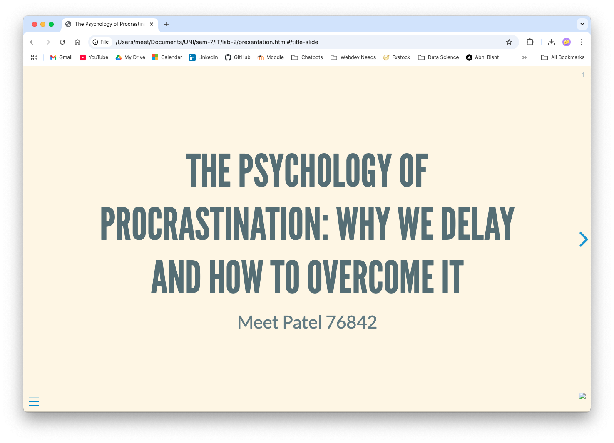
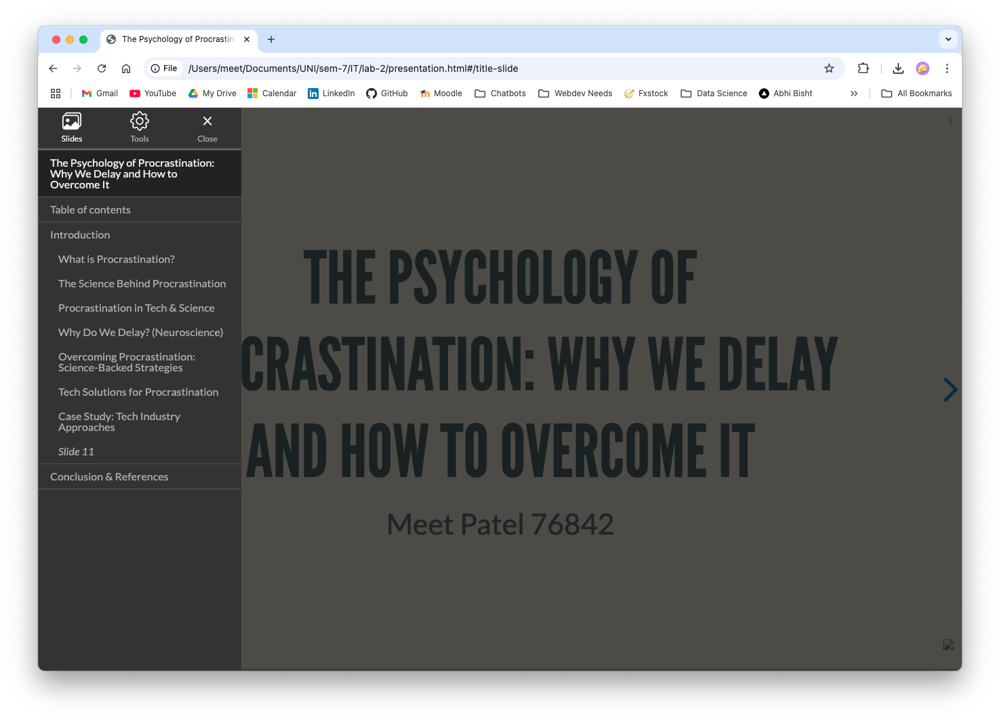
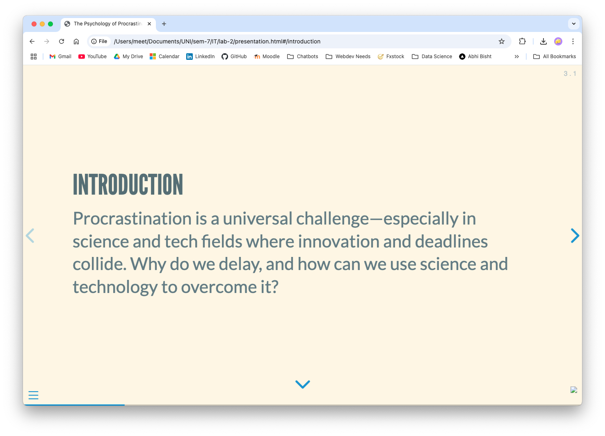

# The Psychology of Procrastination: Why We Delay and How to Overcome It

This project features a Quarto Reveal.js presentation exploring the science and technology behind procrastination, why we delay tasks, and actionable strategies to overcome it. The presentation is tailored for a science and tech audience.

## Features

- 9 slides
- Science & tech theme
- Images and references
- Non-default Reveal.js theme (Solarized)
- Both vertical and horizontal navigation

## Author

Meet Patel 76842

## Getting Started

### 1. Render the Presentation

- Ensure you have [Quarto](https://quarto.org/docs/get-started/) installed.
- Render the presentation with:
  ```sh
  quarto render presentation.qmd
  ```
  This will generate `presentation.html`.

### 2. Publish on GitHub Pages

- Create a new GitHub repository (e.g., `procrastination-presentation`).
- Add your files: `presentation.qmd`, `presentation.html`, `README.md`, and the `assets/` folder with screenshots.
- Push to GitHub.
- Enable GitHub Pages in your repository settings (Settings → Pages → Source: root or `/docs`).
- Access your presentation at:
  `https://<your-github-username>.github.io/<repo-name>/presentation.html`

## Example Links

- **Live Presentation:** [https://your-github-username.github.io/your-repo-name/presentation.html](https://your-github-username.github.io/your-repo-name/presentation.html)
- **Source Code:** [https://github.com/your-github-username/your-repo-name](https://github.com/your-github-username/your-repo-name)

## Screenshots

Screenshots of the presentation are stored in the `assets/` folder:

- 
- 
- 

## References

- [Quarto Reveal.js Guide](https://quarto.org/docs/presentations/revealjs/)
- [Reveal.js Official Site](https://revealjs.com/?demo)
